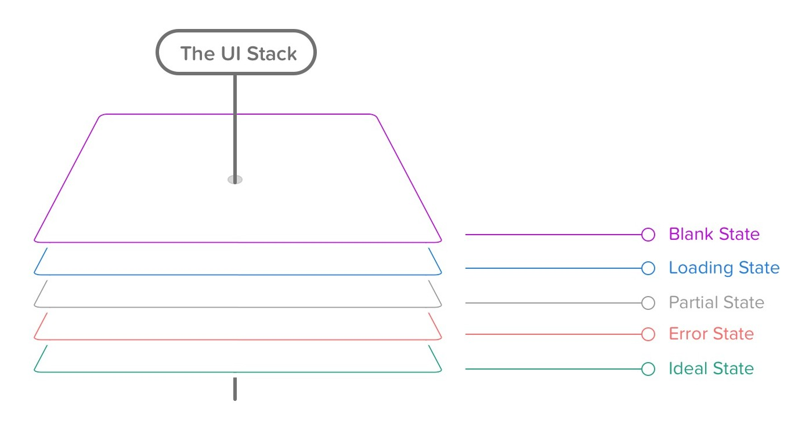

# RemoteData

**Slaying a UI Antipattern with Angular.**

[](https://travis-ci.org/joanllenas/ngx-remotedata)
[](https://badge.fury.io/js/ngx-remotedata)

Library inspired by [Kris Jenkins](https://twitter.com/krisajenkins) blog post about [How Elm slays a UI antipattern](http://blog.jenkster.com/2016/06/how-elm-slays-a-ui-antipattern.html), which mixes pretty well with [another article](http://scotthurff.com/posts/why-your-user-interface-is-awkward-youre-ignoring-the-ui-stack) written by [Scott Hurff](https://twitter.com/scotthurff) about what he calls the _UI Stack_.



## Table Of Contents

- [What we are trying to solve](#trying-to-solving)
  - [The traditional approach](#traditional-approach)
  - [The RemoteData approach](#remotedata-approach)
- [Installation](#installation)
- [Basic Usage](#basic-usage)
- [Examples](#examples)
  - [Demo 👀](#examples-demo)
  - [Basic](#examples-basic)
  - [Services](#examples-services)
  - [Ngrx](#examples-ngrx)
- [Api 📚](#api)
- [Pipes 📚](#pipes)

<a name="trying-to-solving"/>

## What we are trying to solve

We are making an API request and want to display different things based on the request's status.

<a name="traditional-approach"/>

### The traditional approach

```ts
export interface SunriseSunset {
  isInProgress: boolean;
  error: string;
  data: {
    sunrise: string;
    sunset: string;
  };
}
```

Let us see what each property means:

- `isInProgress`: It is `true` while the data is being fetched.
- `error`: It is either `null` (no errors) or any `string` (there are errors).
- `data`: Either `null` (no data) or the result payload (there is data).

There are a few problems with this approach, the main one being that it is possible to create **invalid states** such as:

```json
{
  "isInProgress": true,
  "error": "Fatal error",
  "data": {
    "sunrise": "I am good data.",
    "sunset": "I am good data too!"
  }
}
```

Our html template will have to use complex `*ngIf` statements to make sure we are displaying the correct information.

<a name="remotedata-approach" />

### The RemoteData approach ™

Instead of using a complex data structures we use a single data type to express all possible request states:

```ts
type RemoteData<T, E> = NotAsked | InProgress<T> | Failure<E, T> | Success<T>;
```

This approach **makes it impossible to create invalid states**.

<a name="installation" />

## Installation

`npm install --save ngx-remotedata`

<a name="basic-usage" />

## Basic Usage

```ts
// app.module.ts

import { RemoteDataModule } from 'ngx-remotedata';

@NgModule({
  imports: [
    // (...)
    RemoteDataModule
  ]
})
```

```ts
// app.component.ts

import {
  RemoteData,
  inProgress,
  notAsked,
  success,
  failure,
} from 'ngx-remotedata';

@Component({
  selector: 'app-root',
  templateUrl: './app.component.html',
})
export class AppComponent {
  remoteData: RemoteData<string> = notAsked();

  setNotAsked() {
    this.remoteData = notAsked();
  }

  setInProgress() {
    this.remoteData = inProgress('In progress...');
  }

  setSuccess() {
    this.remoteData = success('Success!');
  }

  setFailure() {
    this.remoteData = failure('Wrong!');
  }
}
```

```html
<!-- app.component.html -->

<ul>
  <li><button (click)="setNotAsked()">Not Asked</button></li>
  <li><button (click)="setInProgress()">InProgress</button></li>
  <li><button (click)="setSuccess()">Success</button></li>
  <li><button (click)="setFailure()">Failure</button></li>
</ul>

<hr />

<h4 *ngIf="remoteData | isNotAsked">Not Asked</h4>
<h4 *ngIf="remoteData | isInProgress">InProgress...</h4>
<h4 *ngIf="remoteData | isSuccess" style="color: green">
  {{ remoteData | successValue }}
</h4>
<h4 *ngIf="remoteData | isFailure" style="color: red">
  {{ remoteData | failureValue }}
</h4>
```

<a name="examples" />

## Examples

<a name="examples-demo" />

#### Demo 👀

- [Stackblitz Ngrx demo](https://stackblitz.com/edit/ngx-remotedata-demo?file=src%2Fapp%2Fmeow%2Freducer.ts)

#### Source code

<a name="examples-basic" />

- [The basics](src/app/examples/basics)

<a name="examples-services" />

- [Plain old services](src/app/examples/pos)

<a name="examples-ngrx" />

- [Ngrx](src/app/examples/ngrx) _(includes store rehydration from `localStorage`)_

<a name="api" />

## Api

### RemoteData 📚

`RemoteData<T, E>`

`RemoteData` is used to annotate your request variables. It wraps all possible request states into one single union type. Use the parameters to specify:

- `T`: The success value type.
- `E`: The error value type (`string` by default).

- Type guard function: `isRemoteData = <T, E>(value: unknown): value is RemoteData<T, E>`.

### NotAsked 📚

- Constructor function: `notAsked<T, E>(): RemoteData<T, E>`.
- Type guard function: `isNotAsked<T, E>(value: unknown): value is NotAsked`.

When a `RemoteData` is a `NotAsked` instance, it means that the request hasn't been made yet.

```ts
type User = { email: string };
const myRemoteData: RemoteData<User> = notAsked();

// (...)

if (isNotAsked(myRemoteData)) {
  // Here myRemoteData is narrowed to NotAsked
}
```

### InProgress 📚

- Constructor function: `inProgress<T, E>(value?: T): RemoteData<T, E>`.
- Type guard function: `isInProgress<T, E>(value: unknown): value is InProgress<T>`.

When a `RemoteData` is an `InProgress` instance, it means that the request has been made, but it hasn't returned any data yet.

The `InProgress` instance can contain a value of the same `T` type as `Success`. Useful when you want to use the last `Success` value while the new data is being fetched.

```ts
type User = { email: string };
const myRemoteData: RemoteData<User> = inProgress({ email: 'john@doe.com' });

// (...)

if (isInProgress(myRemoteData)) {
  // Here myRemoteData is narrowed to InProgress
  console.log(`I have some data: ${myRemoteData.value.email}`);
}
```

### Success 📚

- Constructor function: `success<T, E>(value: T): RemoteData<T, E>`.
- Type guard function: `isSuccess<T, E>(value: unknown): value is Success<T>`.

When a `RemoteData` is a `Success` instance, it means that the request has completed successfully and the new data (of type `T`) is available.

```ts
type User = { email: string };
const myRemoteData: RemoteData<User> = success({ email: 'john@doe.com' });

// (...)

if (isSuccess(myRemoteData)) {
  // Here myRemoteData is narrowed to Success
  console.log(`I have some data: ${myRemoteData.value.email}`);
}
```

### Failure 📚

- Constructor function: `failure<T, E>(err: E, val?: T): RemoteData<T, E>`.
- Type guard function: `isFailure<T, E>(value: unknown): value is Failure<E, T>`.

When a `RemoteData` is a `Failure` instance, it means that the request has failed. You can get the error information (of type `E`) from the payload.

The `Failure` instance can contain a value of the same `T` type as `Success`. Useful when you want to use the last `Success` value while displaying the failure message.

```ts
type User = { email: string };
const myRemoteData: RemoteData<User> = failure('Something went wrong.', {
  email: 'john@doe.com',
});

// (...)

if (isFailure(myRemoteData)) {
  // Here myRemoteData is narrowed to Failure
  console.log(`This is the failure: ${myRemoteData.error}`);
  console.log(`I have some data: ${myRemoteData.value.email}`);
}
```

The default type for errors is `string`, but you can also provide other types like `Error`:

```ts
type User = { email: string };
const myRemoteData: RemoteData<User, Error> = failure(
  new Error('Something went wrong.')
);
```

## Unwrapping RemoteData values

### getOrElse 📚

```ts
getOrElse<T, E>(rd: RemoteData<T, E>, defaultValue: T): T;
```

`getOrElse` _unwraps_ and returns the value of `Success` instances or the `defaultValue` when it's any other `RemoteData` variant.

```ts
// Example
let myRemoteData = success('ok!');
console.log(getOrElse(myRemoteData, 'The default value')); // ok!

myRemoteData = failure('There has been an error');
console.log(getOrElse(myRemoteData, 'The default value')); // The default value
```

### fold 📚

```ts
fold<T, E>(
  onNotAsked: () => T,
  onInProgress: (value: T | undefined) => T,
  onFailure: (error: E, value: T | undefined) => T,
  onSuccess: (value: T) => T,
  rd: RemoteData<T, E>
): T;
```

With `fold` you _unwrap_ the `RemoteData` value by providing a function for each of the type variants.

```ts
// Example
const rd = success('this is fine!');
const result = fold(
  () => 'not asked',
  (val) => 'in progress: ' + val,
  (error, value) => `failure: ${error} ${value}`,
  (value) => 'success: ' + value,
  rd
);
console.log(result); // success: this is fine!
```

## Transforming RemoteData values

### map 📚

```ts
map<A, B, E>(
  fn: (a: A) => B,
  rd: RemoteData<A, E>
): RemoteData<B, E>;
```

With `map` you provide a transformation function that is applied to a `RemoteData` only when it's a `Success` instance.

```ts
// Example
const scream = (s: string) => s.toUpperCase();
const hello = success('hello!');
const helloScreaming = map(scream, hello);
console.log(helloScreaming); // success('HELLO!')
```

### mapFailure 📚

```ts
mapFailure<A, E, F>(
  fn: (e: E) => F,
  rd: RemoteData<A, E>
): RemoteData<A, F>;
```

With `mapFailure` you provide a transformation function that is applied to a `RemoteData` only when it's a `Failure` instance.

```ts
// Example
const scream = (s: string) => s.toUpperCase();
const error = failure('wrong!');
const wrongScreaming = mapFailure(scream, error);
console.log(wrongScreaming); // failure('WRONG!')
```

### chain 📚

```ts
chain<A, B, E>(
  fn: (a: A) => RemoteData<B, E>,
  rd: RemoteData<A, E>
): RemoteData<B, E>;
```

With `chain` you can provide a transormation function that can change the returned `RemoteData` variant.

```ts
// Example
const checkAge = (n: number) =>
  n >= 0 ? success(n) : failure(`${n} is an invalid age`);
let ageResult = chain(checkAge, success(25));
expect(ageResult).toEqual(success(25));
ageResult = chain(checkAge, success(-3));
expect(ageResult).toEqual(failure('-3  is an invalid age'));
```

## RxJs operators

### filterSuccess 📚

Specialized version of the rxjs `filter` operator for `RemoteData` values.
Emits only when source `Observable` is a `Success`, also narrows the emitted value to `Success`.

```ts
// Example
const myRemoteData = success(3);
of(myRemoteData)
  .pipe(
    filterSuccess(),
    map((s) => s.value * 2)
  )
  .subscribe((n) => {
    console.log(n); // 6
  });
```

### filterFailure 📚

Specialized version of the rxjs `filter` operator for `RemoteData` values.
Emits only when source `Observable` is a `Failure`, also narrows the emitted value to `Failure`.

```ts
// Example
const myRemoteData = failure('wrong!');
of(myRemoteData)
  .pipe(
    filterFailure(),
    map((f) => 'Error: ' + f.error)
  )
  .subscribe((err) => {
    console.log(err); // 'Error: wrong!'
  });
```

<a name="pipes" />

## Pipes

### isNotAsked 📚

`transform<T, E>(rd: RemoteData<T, E>): boolean;`

Returns `true` when `RemoteData` is a `NotAsked` instance.

### anyIsNotAsked 📚

```ts
transform<T, E>(
  rds$: Observable<RemoteData<T, E>>[]
): boolean;
```

Returns `true` when any `RemoteData<T, E>[]` items is a `NotAsked` instance.

### isInProgress 📚

`transform<T, E>(rd: RemoteData<T, E>): boolean;`

Returns `true` when `RemoteData` is an `InProgress` instance.

### anyIsInProgress 📚

```ts
transform<T, E>(
  rds$: Observable<RemoteData<T, E>>[]
): boolean;
```

Returns `true` when any `RemoteData<T, E>[]` item is an `InProgress` instance.

### isFailure 📚

`transform<T, E>(rd: RemoteData<T, E>): boolean;`

Returns `true` when `RemoteData` is a `Failure` instance.

### isSuccess 📚

`transform<T, E>(rd: RemoteData<T, E>): boolean;`

Returns `true` when `RemoteData` is a `Success` instance.

### hasValue 📚

`transform<T, E>(rd: RemoteData<T, E>): boolean;`

Returns `true` when `RemoteData` is a `Success` instance or is an `InProgress` or `Failure` instance with a value that is not `null` or `undefined`.

### successValue 📚

```ts
transform<T, E>(
  rd: RemoteData<T, E>,
  defaultValue?: T
): T | undefined;
```

Returns the `Success` payload (of type `T`) when the `RemoteData` is a `Success` instance, otherwise it returns the `defaultValue` when provided or `undefined` when not.

### inProgressValue 📚

```ts
transform<T, E>(
  rd: RemoteData<T, E>,
  defaultValue?: T | undefined
): T | undefined;
```

Returns the `InProgress` payload (of type `T`) when `RemoteData` is an `InProgress` instance, otherwise it returns the provided `defaultValue` or `undefined` when not.

### remoteDataValue 📚

`transform<T, E>(rd: RemoteData<T, E>): T | E | undefined;`

Returns the `InProgress`, `Failure` or `Success` payload (of type `T`) when `RemoteData` is an `InProgress`, `Failure` or `Success` instance. Returns `undefined` otherwise.

### failureError 📚

`transform<T, E>(rd: RemoteData<T, E>): E | undefined`

Returns the `Failure` error payload (of type `E`) when `RemoteData` is a `Failure` instance or `undefined` otherwise.

### failureValue 📚

`transform<T, E>(rd: RemoteData<T, E>): T | undefined`

Returns the `Failure` payload (of type `T`) when `RemoteData` is a `Failure` instance or `undefined` otherwise.
